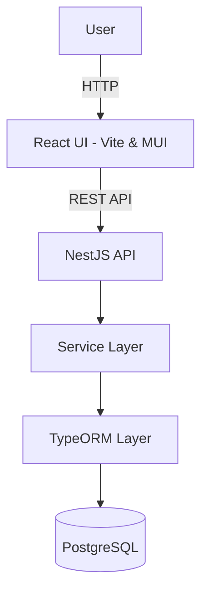
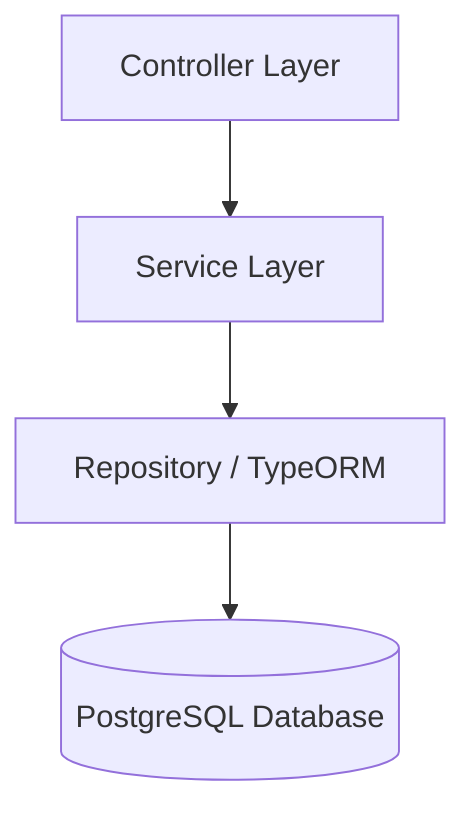
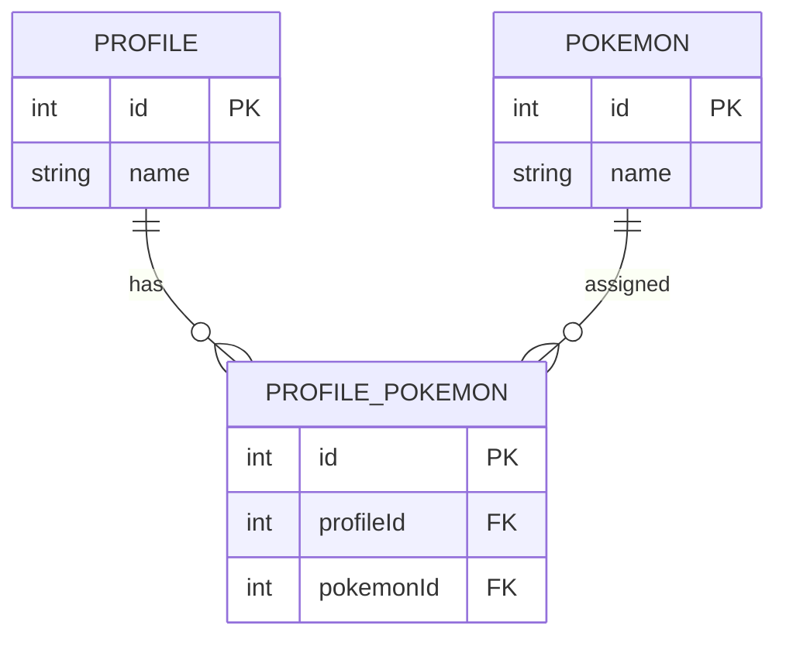
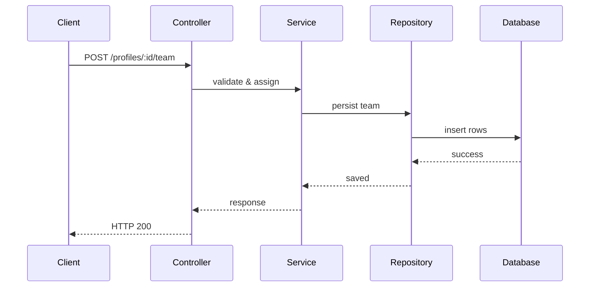

# 🚀 Pokémon Team Builder – Engineering Interview Submission

## Overview

This project implements a full-stack Pokémon Team Builder application using a modern monorepo architecture.

Users can:

- View the first 150 Pokémon
- Create profiles
- Select up to 6 Pokémon per profile
- Persist teams to PostgreSQL
- Explore documented API endpoints via Swagger

The solution emphasizes:

- Clean architecture
- Separation of concerns
- Proper domain modeling
- API documentation
- Automated testing
- Reproducible local development

---

# 🏗 High-Level Architecture



---

# 🧱 Backend Architecture (Layered)



The backend follows a modular, MVC-inspired layered architecture:

```
Controller → Service → Repository → Database
```

- Controllers handle HTTP concerns
- Services enforce business rules
- TypeORM handles persistence
- Entities represent the domain model

---

# 🧩 Data Model (ERD)



### Why an Explicit Join Entity?

Instead of using a direct ManyToMany mapping, an explicit `ProfilePokemon` entity was implemented to:

- Allow enforcing constraints cleanly
- Support future extensibility (e.g., team order, metadata)
- Maintain better control over persistence

---

# 🔄 Request Flow Example – Assign Team



---

# 🧠 Design Decisions

### 1. Explicit Join Table

Provides extensibility and strong domain modeling.

### 2. DTO Layer

DTOs are used to:

- Decouple API contracts from persistence models
- Enable Swagger schema generation
- Enforce request validation

### 3. Swagger Integration

Swagger provides:

- Interactive API documentation
- Clear endpoint visibility
- Reviewer convenience

Documentation available at:

```
http://localhost:3000/api/docs
```

### 4. Testcontainers

The backend uses Testcontainers to automatically spin up PostgreSQL during development.

Benefits:

- No manual DB setup
- Reproducible local environment
- Isolated test execution

---

# 🛠 Tech Stack

Backend:
- NestJS
- TypeORM
- PostgreSQL
- Swagger (OpenAPI)
- class-validator
- Testcontainers

Frontend:
- React (Vite)
- Material UI

Monorepo:
- Nx
- pnpm

---

# 🧪 Running the Project

## 1️⃣ Install Dependencies

```bash
pnpm install
```

---

## 2️⃣ Run Backend

```bash
pnpm nx serve pokemon-user-backend
```

Backend runs at:

```
http://localhost:3000/api
```

Swagger:

```
http://localhost:3000/api/docs
```

---

## 3️⃣ Run Frontend

In a separate terminal:

```bash
pnpm nx serve pokemon-ui
```

Frontend runs at:

```
http://localhost:4200
```

---

# 🧪 Running Tests

## Backend E2E Tests

```bash
pnpm nx e2e pokemon-user-backend-e2e
```

Tests validate:

- Profile creation
- Team assignment
- Enforcement of the 6 Pokémon constraint

---

# 📦 Database

PostgreSQL is started automatically via Testcontainers.

Configuration:

- Database: pokemon
- Username: admin
- Password: admin
- Port: 5432

No manual setup required.

---

# 📚 API Endpoints

### GET /api/pokemon

Returns the first 150 Pokémon.

---

### POST /api/profiles

Creates a new profile.

Request:

```json
{
  "name": "Ash"
}
```

---

### POST /api/profiles/:id/team

Assigns Pokémon to a profile (maximum of 6).

Request:

```json
{
  "pokemonIds": [1, 2, 3, 4, 5, 6]
}
```

---

# 🔐 Validation

- Maximum of 6 Pokémon enforced
- DTO validation enabled globally
- Invalid input returns HTTP 400

---

# 🚀 Potential Extensions

- Pagination for Pokémon list
- Team slot ordering (1–6)
- Caching layer
- Role-based access
- Production DB configuration
- CI/CD pipeline
- Containerized deployment

---

# 🎯 Summary

This implementation demonstrates:

- Clean modular NestJS architecture
- Proper relational modeling
- Business rule enforcement at the service layer
- API documentation via Swagger
- Automated E2E tests
- Reproducible development environment
- Structured monorepo architecture using Nx

The focus was correctness, clarity, and maintainability while avoiding unnecessary complexity.

---

# 👤 Author

Ayokunle Ade-Aina  
Software Engineer